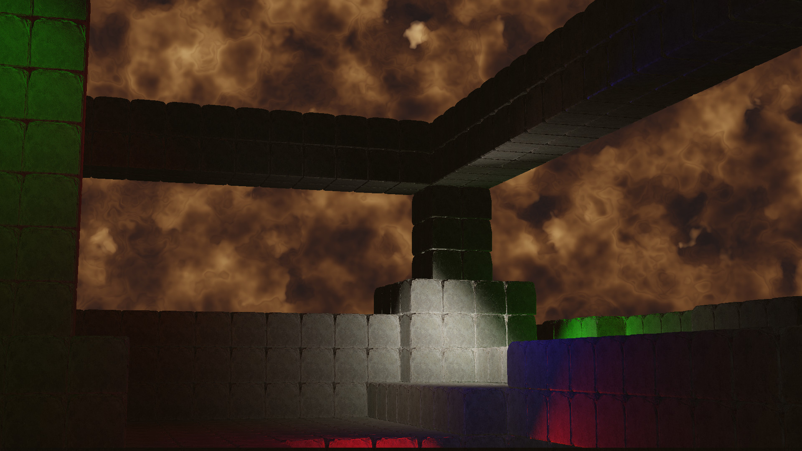

# Signed Distance Fields

SDF's are a convenient way of representing geometry that allows for quick ray marching.  It is commonly used to draw both solids and gases.  In this sample, the background is drawn as a noisy sdf.

