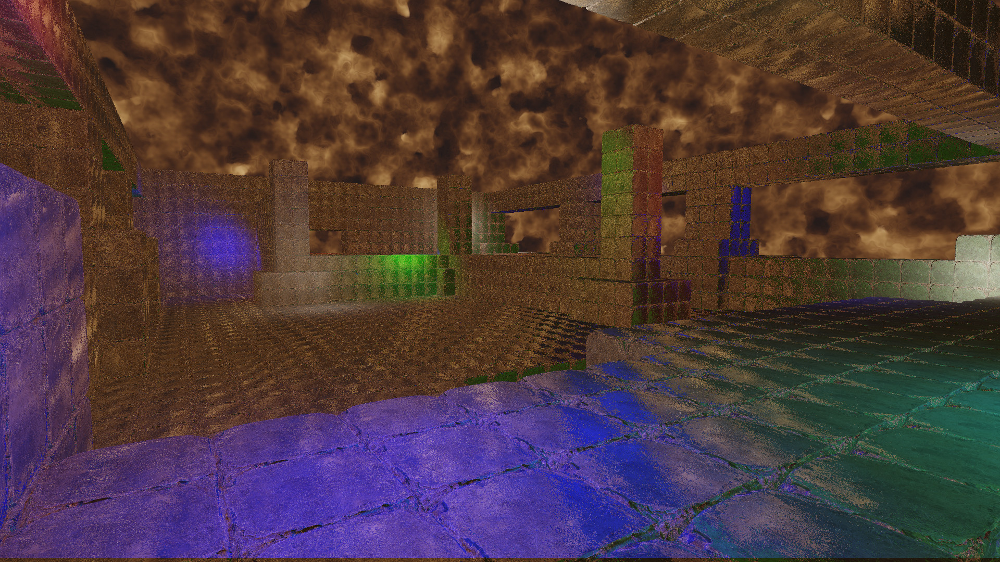
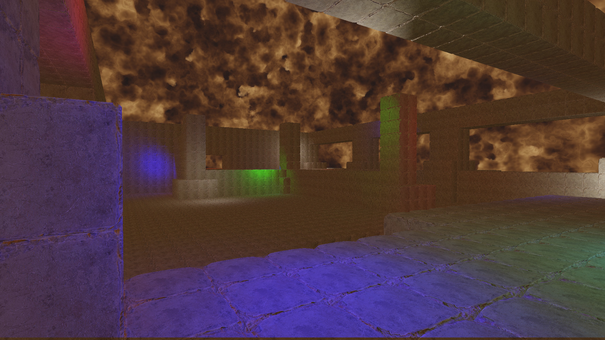

# Light Probe

A light probe is a cubemap that is used for reflections (I've also seen these referred to as reflection maps or environment maps).  Each mip of the cubemap is generated using the angle for a reflection lobe.  These mips are then associated with different levels of roughness for a material.  At runtime, the generated light probe is sampled for different reflection lobes.

An important aspect to note is how Vulkan interprets the orientations of the faces of a cubemap.  The cubemap is stored in memory in this order [+x,-x,+y,-y,+z,-z].

It's actually rather annoying that each api uses a different cubemap orienation.  I use +z as up and +x as forward for my cubemap and then simply upload it in an orientation that Vulkan is okay with (whatever its default orientation is).

https://learnopengl.com/Advanced-OpenGL/Cubemaps

https://registry.khronos.org/vulkan/specs/1.2/html/chap16.html#_cube_map_face_selection

DirectX uses a different orientation:
https://learn.microsoft.com/en-us/windows/win32/direct3d9/cubic-environment-mapping

https://www.khronos.org/opengl/wiki/Cubemap_Texture

In order to build the light probe you will need to uncomment the line: //#define GEN_LIGHTPROBE

That will build and save the light probe to file.  Re-running the program with the line commented out will make the program use the built light probe for rendering.