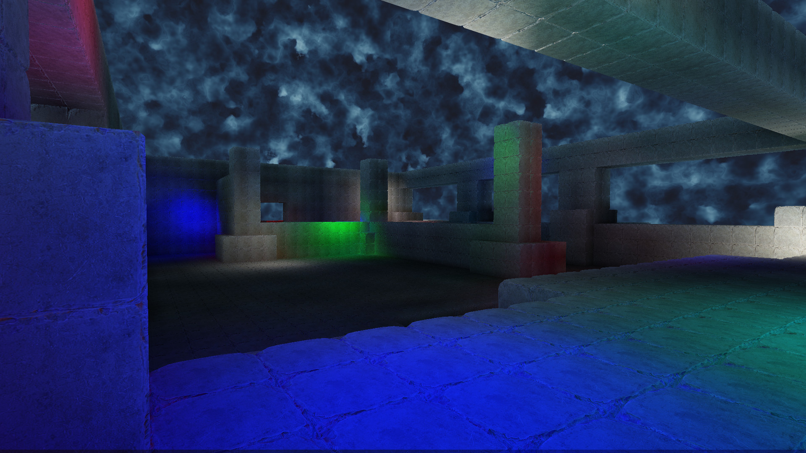
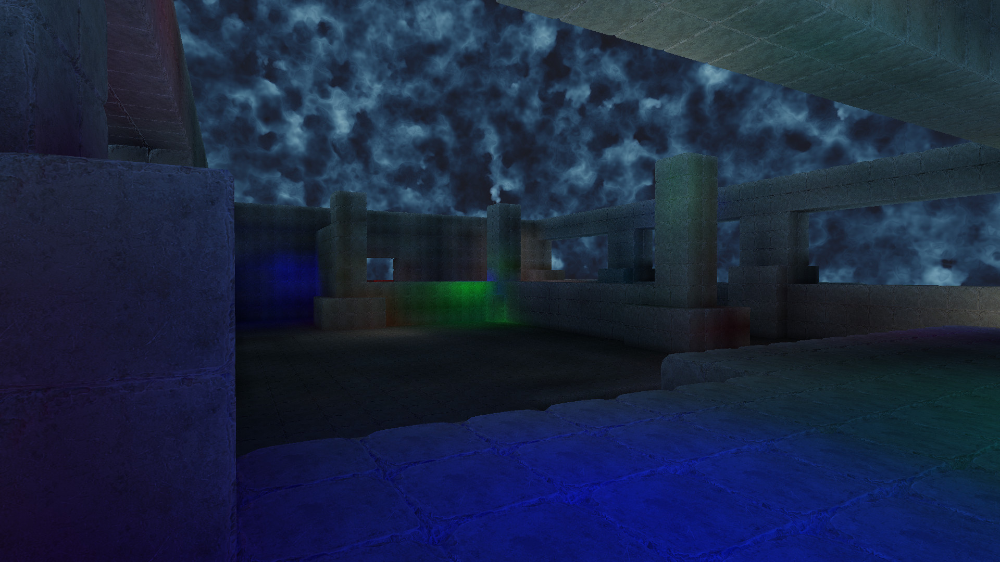
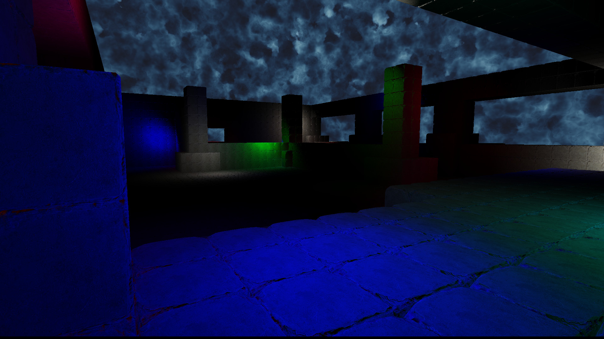

# Spherical Harmonics Ambient

Spherical harmonics comes from a field of mathematics called partial differential equations.  They are the solutions to the wave equation in spherical coordinates.

These can be used to approximate any function/distribution on the surface of a sphere.  Similar to how the taylor series can approximate single variable functions.

This means that spherical harmonics can be used to approximate a cubemap.  And it was found that if you throw away the higher order terms then they will closely represent the irradiance.  Which means that we can efficiently store and blend between ambient nodes using spherical harmonics.

The only downside can be with highly anisotropic lighting, such as an outdoor scene with a bright sun.  This can cause ringing in the harmonics, there have been attempts to reduce this ringing.  And I have included some of the literature on deringing methods in this sample.

In this particular sample, the spherical harmonics are stored in 3d textures and sampled as a voxelized space.  This does mean that if the voxels are too large and the walls too thin, that there can be light leaking, but it shouldn't be a serious problem for this sample.

