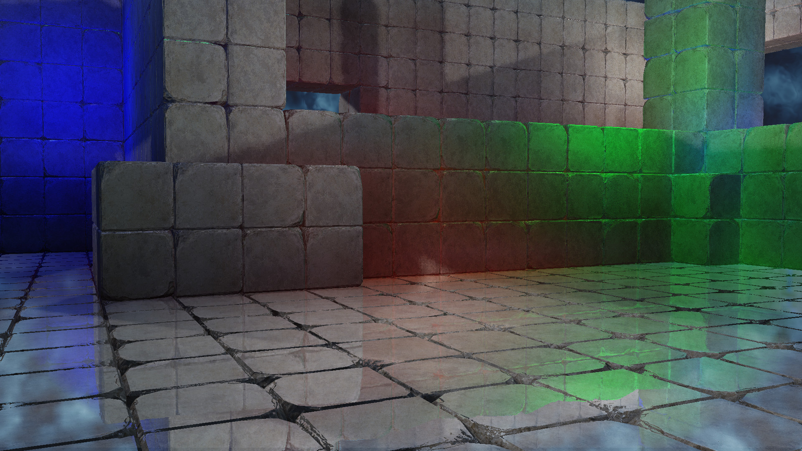

# Screen Space Reflections

Screen space reflections are an efficient way to achieve realistic reflections in a rendered scene.  While light probes are also an effective way to achieve reflections they suffer from being static and parallex incorrect.  SSR on the other hand will produce correct reflections and include dynamic objects and lights.