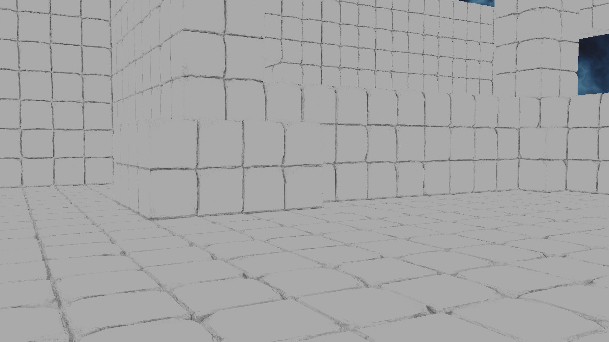
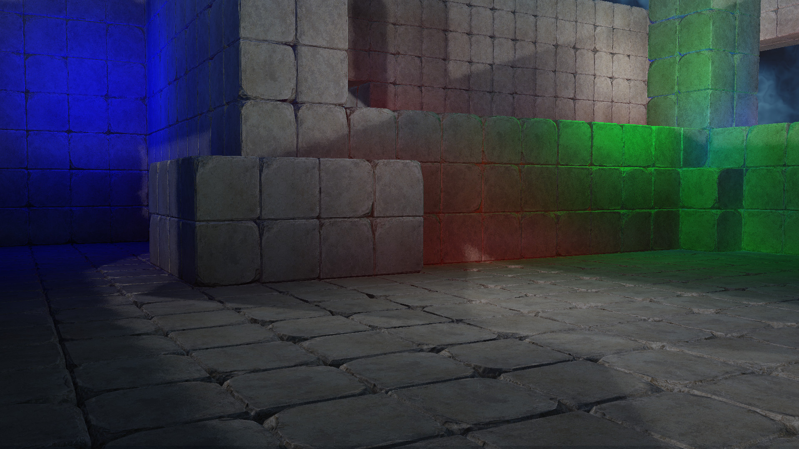
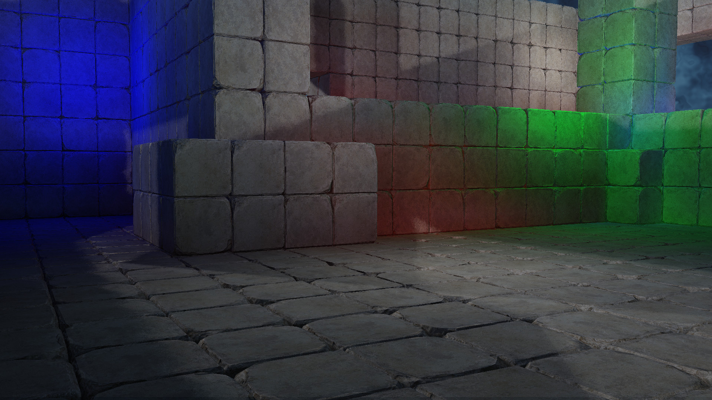

# Screen Space Ambient Occlusion

Ambient occlusion is a method to make sure that ambient light is not overlighting a surface that is partially occluded.  Ambient lighting is generally calculated assuming that a surface is flat and unoccluded, therefore taking in a full hemisphere of sampling.  For a surface that is partially occluded (ie the corner of a room) then the pre-calculated ambient will over light the surfaces near the corner.  Therefore we need to multiply the ambient by a factor that takes into account the occlusion.

SSAO attempts to make this calculation using only screen space information.  This method is similar to SSR, as both methods requiring sampling the screen space data. In SSAO we ray march through the rendered scene to determine the occlusion of a fragment.