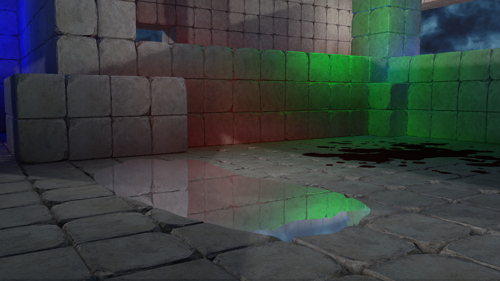

# Decals

Decals are an effective way to create extra detail without adding geometric complexity, both static and dynamic.  Here they are implemented using projective texturing into the g-buffer.  This sample uses them to add blood splatter and water pools to the scene.