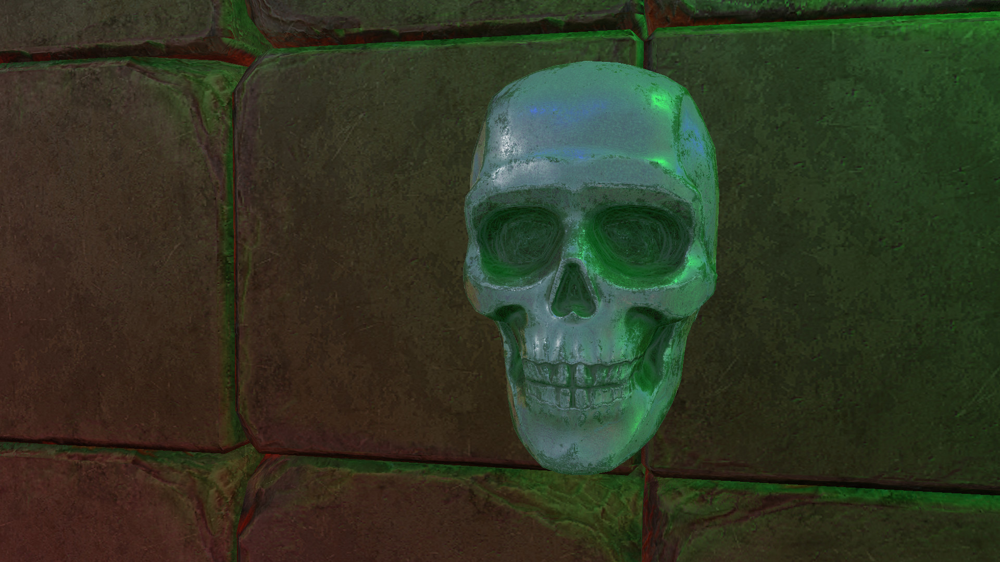
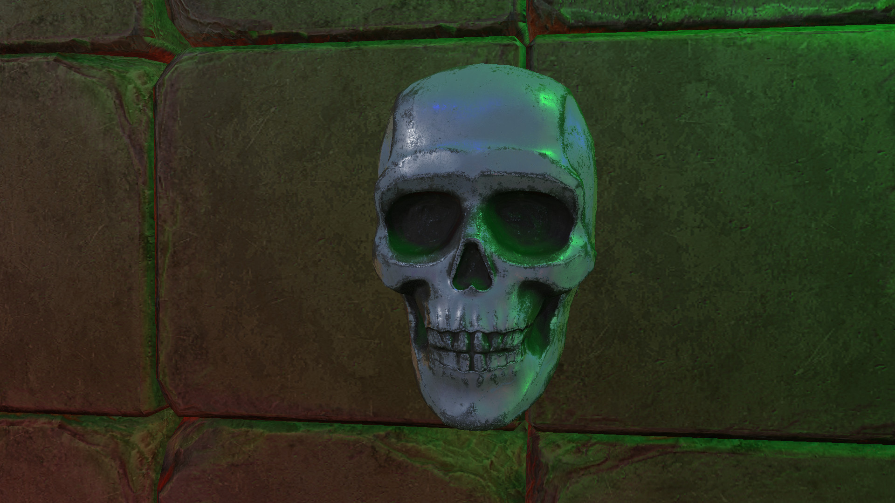
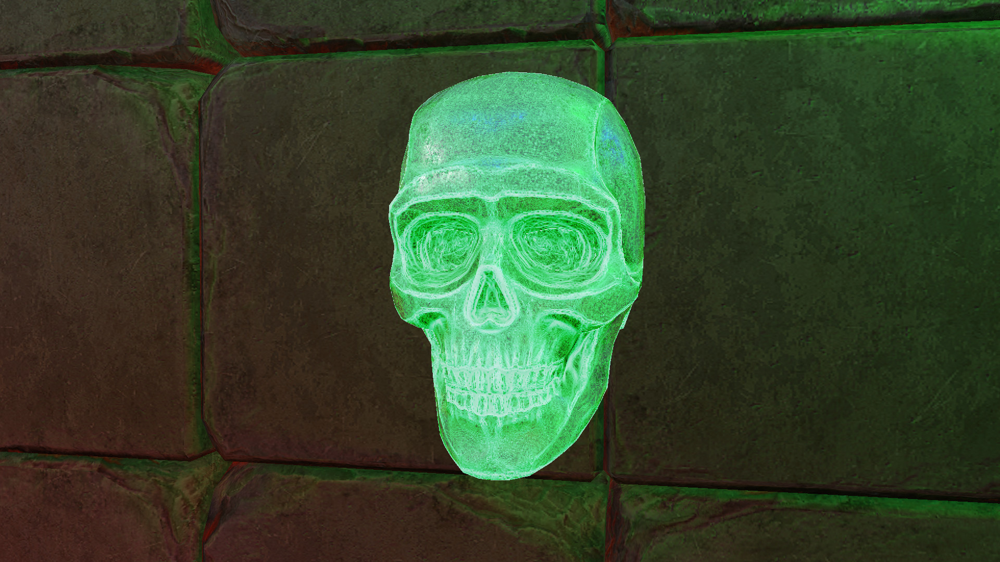

# Screen Space Subsurface Scattering

In order to see the subsurface scattering, here's an image without any scattering:

And an extreme level of scattering:

Subsurface scattering is light going a few layers deep into a material, bouncing around, and eventually exiting the material.  This creates a warm glow for certain materials.  Some common examples of materials with subsurface scattering are skin, marble, and wax.

A commonly used approach for subsurface scattering is to use screen space information.  This is the approach taken here.  In this sample, the local curvature of a fragment is calculated using the world position and world normal.  This is then used to look into a precomputed table of scattering for spheres of varying radius.

Here are some links on various methods for subsurface scattering:

https://advances.realtimerendering.com/s2018/Efficient%20screen%20space%20subsurface%20scattering%20Siggraph%202018.pdf

https://therealmjp.github.io/posts/sss-intro/

https://www.iryoku.com/sssss/downloads/Screen-Space-Perceptual-Rendering-of-Human-Skin.pdf

https://developer.nvidia.com/gpugems/gpugems/part-iii-materials/chapter-16-real-time-approximations-subsurface-scattering
