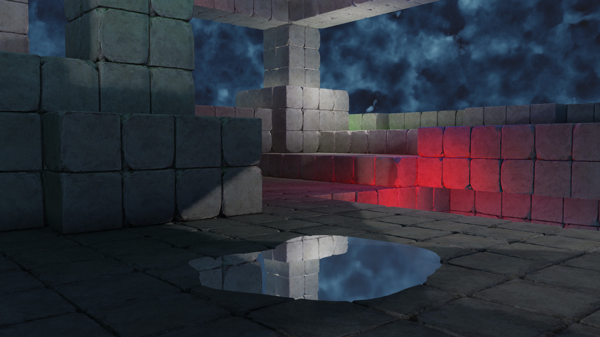
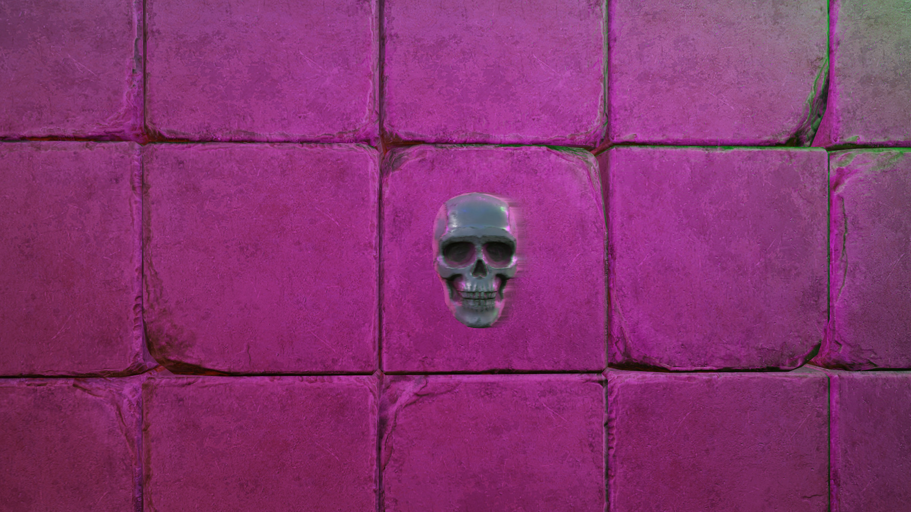

# Temporal Anti-Aliasing

Aliasing is the result of rendering to a perfect grid of pixels.  Basically, an edge that should be straight ends up appearing as though it is a jagged edge or staircased.  This is sometimes referred to as the screen door effect, as it can appear as though you're looking through a screen door.

The first attempt to solve this was known as Multi-Sampling Anti-Aliasing (MSAA).  This was done in the hardware by rasterizing triangles at the subpixel level four times.  MSAA works to solve jagged edges on sloped triangles, but it doesn't solve aliasing caused by high frequency textures.

In order to solve the problem of aliasing from high frequency textures, other anti-aliasing methods were developed such as FXAA and SSAA.  No anti-aliasing method is perfect, some introduce blur, others are expensive to render.

TAA attempts to bridge the gap by increasing fidelity without adding a large computational cost.  The temporal method is an iterative approach.  In real-time rendering we have lots of frames, and most of the scene doesn't change much from frame to frame.  TAA takes the information from the previous frame, that is still valid, and combines it with the current frame to effectively create a super sampled frame.

The basic steps in TAA are:

1. Jitter the camera at a sub-pixel level (this creates the effective super sampling).  Halton sequences have been found to be an effective jitter.
2. Render a per-pixel velocity buffer, using the difference between the current and previous frame's matrices.
3. Sample the history buffer (the previous frame) using the per-pixel velocity (this is known as re-projection).
4. Reject any invalid history buffer pixels using a heuristic.
5. Combine valid history pixels with the pixels of the current frame.

One heuristic for rejecting invalid history pixels is to compare the depth of the last frame's pixel depth to the current frame's.  If the old depth was occluded, then it should be rejected.  Which works well to prevent ghosting from a moving a camera or moving object.  But if a light is moving in the scene, then ghosting will still occur.

Another heuristic, and the one used in this sample, is to use neighborhood clamping.  It's simple and works well for all situations.

Some of examples of ghosting when there's no heuristic.  Here, the skull and the magenta light are moving in opposite directions:

