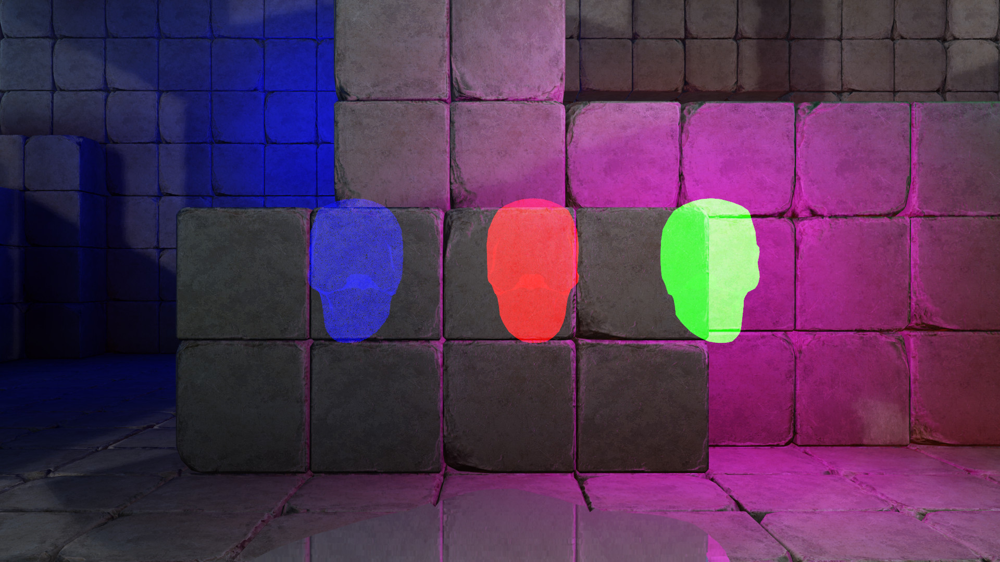
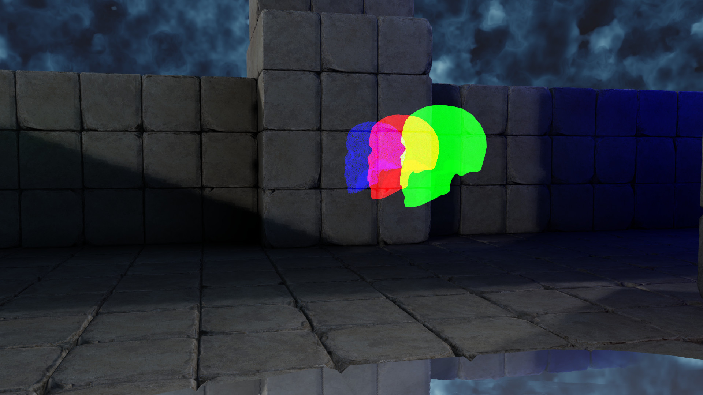
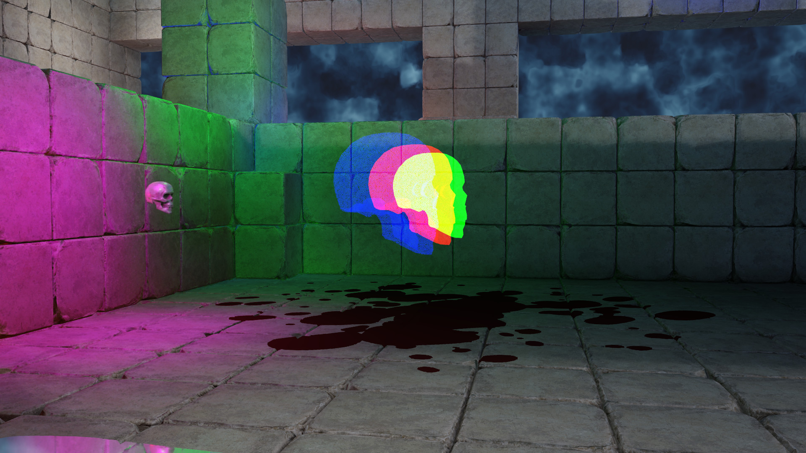

# Order Independent Transparency

Transparency is a tricky thing in rasterization.  Because the order in which the transparent triangles are drawn matters.  You can sort your triangles by depth and using the painter's algorithm, but this doesn't solve the problem of overlapping/intersecting triangles.

A-buffer OIT is the oldest technique that I am aware exists.  It stores a per pixel linked list of transparent fragments/pixels that can be sorted and drawn in the correct order.

Depth peeling was developed in the early 2000's.  It worked by using two different depth buffers with multiple render passes to properly draw the transparent triangles.

Stochastic OIT is screendoor transparency that uses the alpha channel of the fragment/pixel and a random number to determine if the fragment/pixel should be drawn.  This is the technique used in this sample.