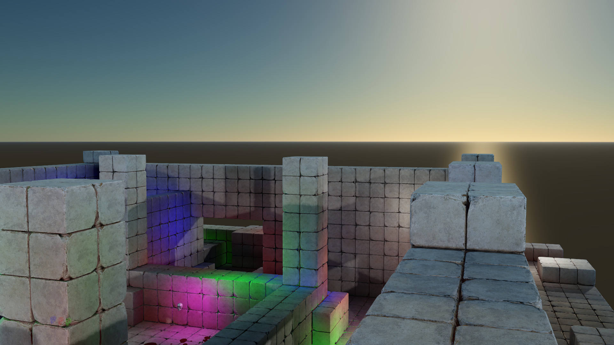

# Atmosphere

This sample replaces the skybox with a simulation of atmospheric scattering based on Bruneton's paper "Precomputed Atmospheric Scattering" available here:
https://ebruneton.github.io/precomputed_atmospheric_scattering/