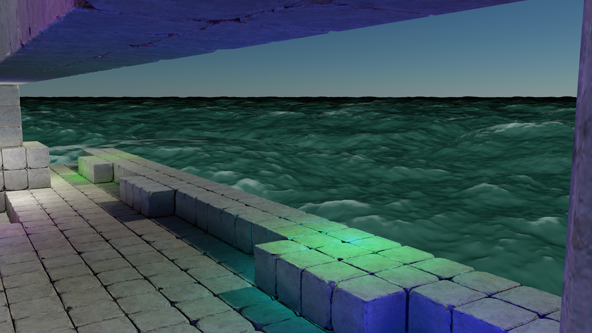
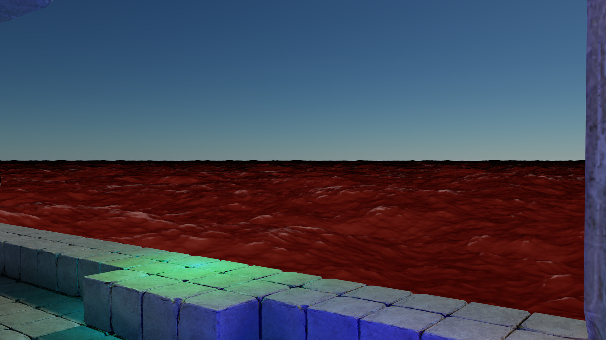

# Ocean

This sample renders an ocean that is simulated using a technique outlined in a paper titled "Simualting Ocean Water" by Jerry Tessendorf.

The first step is to calculate the Phillip's spectrum of the ocean waves from gravity and wind velocity.  An FFT is then performed to transform from the momentum space spectrum to the physical space.  This gives us a heightmap for the ocean waves.

The ocean is then drawn using a screen space grid that is projected onto the ocean surface using the heightmap.