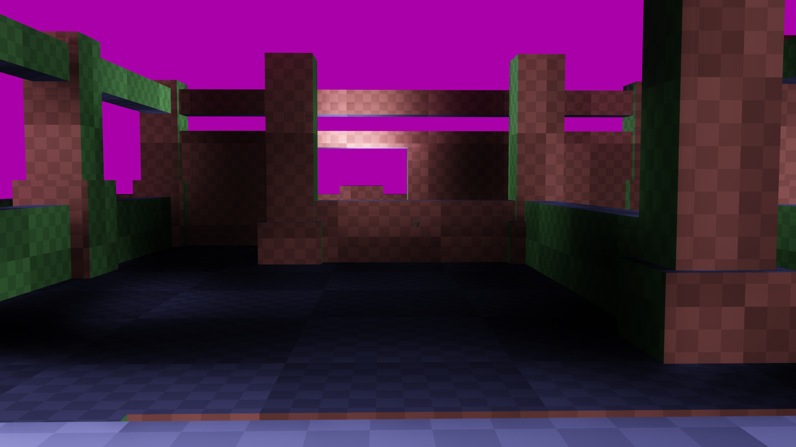
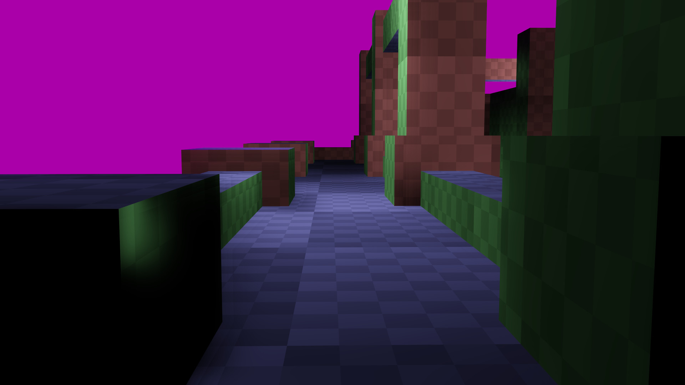
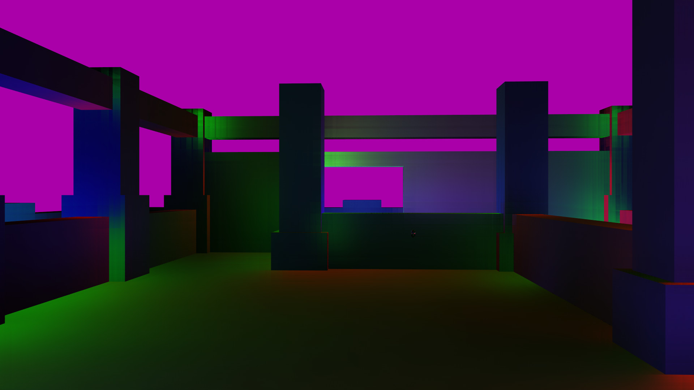
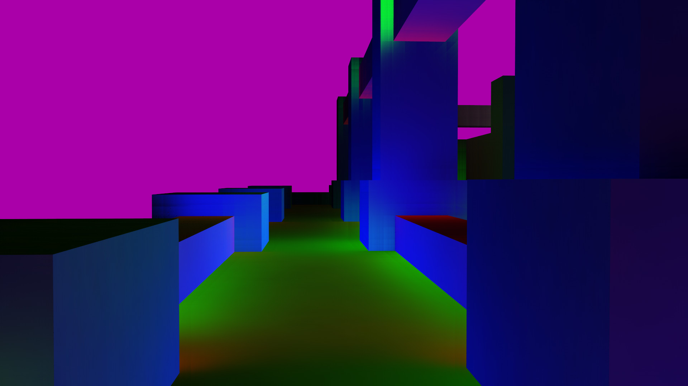
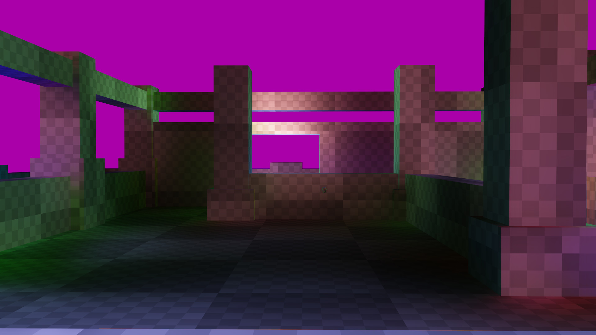
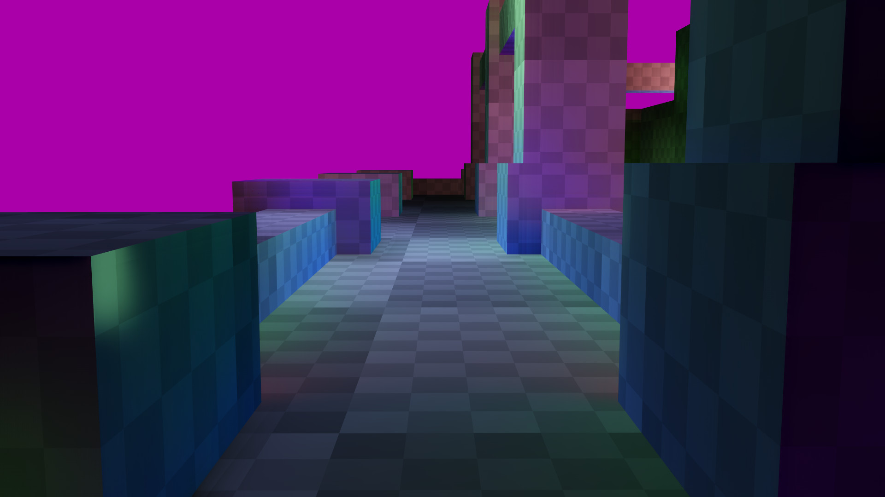

# Ray Tracing

Spatiotemporal Reservoir Resampling (ReSTIR) is an algorithm for path tracing that presents high quality results with only a few samples per pixel.

https://cs.dartmouth.edu/~wjarosz/publications/bitterli20spatiotemporal.html

https://research.nvidia.com/publication/2021-06_restir-gi-path-resampling-real-time-path-tracing

https://dl.acm.org/doi/10.1145/3587423.3595511

https://research.nvidia.com/publication/2022-07_generalized-resampled-importance-sampling-foundations-restir

Quake2 PT denoising links:
https://developer.download.nvidia.com/video/gputechconf/gtc/2019/presentation/s91046-real-time-path-tracing-and-denoising-in-quake-2.pdf
https://cg.ivd.kit.edu/atf.php
https://www.youtube.com/watch?v=zsKl6f22PAE
https://alain.xyz/blog/ray-tracing-denoising
https://cg.ivd.kit.edu/svgf.php
https://cg.ivd.kit.edu/publications/2017/svgf/svgf_preprint.pdf
https://www.youtube.com/watch?v=7uPLAC5uB8c	// Raytracing and Denoising (nvidia talk)
https://www.youtube.com/watch?v=HSmm_vEVs10	// two minute papers on svgf filtering
https://www.youtube.com/watch?v=FewqoJjHR0A	// real-time path tracing and denoising in quake 2 rtx (nvidia talk)
https://developer.nvidia.com/blog/path-tracing-quake-ii/
https://developer.nvidia.com/blog/real-time-path-tracing-and-denoising-in-quake-ii-rtx/
outer product on a normal vector

https://research.nvidia.com/sites/default/files/pubs/2017-07_Spatiotemporal-Variance-Guided-Filtering%3A//svgf_preprint.pdf
https://teamwisp.github.io/research/svfg.html
https://research.nvidia.com/publication/2017-07_spatiotemporal-variance-guided-filtering-real-time-reconstruction-path-traced
https://cg.ivd.kit.edu/publications/2018/adaptive_temporal_filtering/adaptive_temporal_filtering.pdf
https://gist.github.com/pissang/fc5688ce9a544947e0cea060efec610f
https://jo.dreggn.org/home/2010_atrous.pdf

// Lecture on Edge Avoid A-Trous Wavelet
https://www.youtube.com/watch?v=_NwJd0pg4Fo
https://www.uni-ulm.de/fileadmin/website_uni_ulm/iui.inst.100/institut/Papers/atrousGIfilter.pdf
https://github.com/NVIDIA/Q2RTX/blob/master/src/refresh/vkpt/shader/asvgf_atrous.comp
https://github.com/NVIDIA/Q2RTX/blob/master/src/refresh/vkpt/asvgf.c
https://cg.ivd.kit.edu/atf.php

// Lecture on re-creating nanite
https://www.youtube.com/watch?v=MTCIX3AUDBk

// Q2VKPT project page
https://brechpunkt.de/q2vkpt/
https://github.com/cschied/q2vkpt/
https://brechpunkt.de/q2vkpt/gdc_gtc_2019_q2vkpt.pdf
https://www.youtube.com/watch?v=Fv-jStEsCpE	// Gradient Estimation for Real-Time Adaptive Temporal Filtering
https://history.siggraph.org/learning/importance-sampling-of-many-lights-with-adaptive-tree-splitting-by-estevez-and-kulla/
https://history.siggraph.org/wp-content/uploads/2022/09/2017-Talks-Estevez_Importance-Sampling-of-Many-Lights-with-Adaptive-Tree-Splitting.pdf
// Importance Sampling of Many Lights with Adaptive Tree Splitting
https://www.youtube.com/watch?v=U5LXWt2dCXs // Q2VPT Denoiser discussion

// Blog post on raytracing/denoising
https://diharaw.github.io/post/adventures_in_hybrid_rendering/

// Fast Denoising with Self-Stabilizing Recurrent Blurs 2020 NVidia Dmitry Zhdan
https://gdcvault.com/play/1026701/Fast-Denoising-With-Self-Stabilizing

// ReBLUR: A Hierarchical Recurrent Denoiser 2021 Dmitry Zhdan
https://www.researchgate.net/publication/354065087_ReBLUR_A_Hierarchical_Recurrent_Denoiser

// Weighted A-Trous Linear Regression (WALR) for Real-Time Diffuse Indirect Lighting Denoising AMD 2022 Sylvain Meunier
https://gpuopen.com/download/publications/GPUOpen2022_WALR.pdf

// Dynamic Diffuse Global Illumination with ray-Traced Irradiance Fields
https://jcgt.org/published/0008/02/01/

https://diharaw.github.io/post/adventures_in_hybrid_rendering/
https://gdcvault.com/play/1026701/Fast-Denoising-With-Self-Stabilizing

https://whoisryosuke.com/blog/2023/learning-directx-12-in-2023#getting-started-with-direct-x-12
https://www.3dgep.com/learning-directx-12-1/

// SVGF
https://research.nvidia.com/publication/2017-07_spatiotemporal-variance-guided-filtering-real-time-reconstruction-path-traced
https://github.com/NVIDIAGameWorks/Falcor/tree/master/Source/RenderPasses/SVGFPass

//ReSTIR
https://intro-to-restir.cwyman.org/
https://intro-to-restir.cwyman.org/presentations/2023ReSTIR_Course_Notes.pdf
https://research.nvidia.com/labs/rtr/tag/restir/
https://research.nvidia.com/publication/2021-06_restir-gi-path-resampling-real-time-path-tracing

